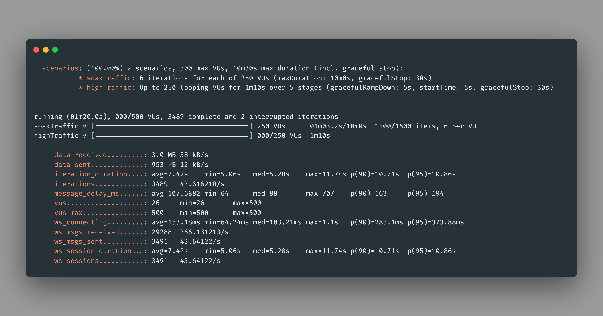

# 🏆 Benchmarks


In summary: soketi is really fast!

In the benchmarking scenario above, there are 250 users that sit idle and receive 1 message per second while 250 users are actively connecting and disconnecting after 5 seconds.

The benchmark was performed on an AWS `t3.small` instance (T3 Unlimited disabled to avoid bursting) @ 2 vCPU 2 GB and Gigabit network in the `Europe Frankfurt` region. The ping between client location and server location averaged \~ 40ms.

The network overhead was taken into account by subtracting the ping twice, since the client trips once to the server to broadcast the message and makes another trip back again from the server to the client.

To calculate the internal time the server needs to process and distribute the received message, you can use the following formula:

```
INTERNAL_TIME = CALCULATED_DELAY - (NETWORK_PING * 2)
```

In this scenario, the processing time (excluding networking overhead) it takes for soketi to process a message in this scenario is:

```
INTERNAL_TIME = 119 - (40 * 2) = 119 - 80 = 39 ms
```

So, for a 2 vCPU 2 GB instance, it takes the server `39ms` to distribute the messages for 250 concurrent users, in addition to a connecting-disconnecting ramp-up amount of between 100 and 250 users. As you can see, soketi easily handles this load scenario.

### ARM Performance

Within the same scenario, but with AWS's Graviton instances (`t4g` ), the performance delivered was 30% greater using the Docker ARM builds.



### Performance Caveats

You may also want to consider additional overhead when deploying soketi:

* Networking overhead, like the overhead included in this benchmark or when horizontally scaling with Redis.
* SSL/TLS overhead, which is inherent to SSL/TLS.
* These benchmarks do not utilize queues. When queues are used to process messages, additional computing power is needed to fulfill webhooks.
* These benchmarks do not account for HTTP requests for other non-broadcasting calls, since these benchmarks only used the HTTP API to publish messages.

When deploying soketi to production in very demanding applications, consider the following suggestions:

#### Scale horizontally

soketi natively [scales horizontally using Redis Pub/Sub](advanced-usage/horizontal-scaling.md). This can add overhead for the internal Redis communication; however, since you can horizontally scale your soketi servers, total scalability is increased.

In addition, by deploying soketi instances closer to Redis read replicas within a global Redis mesh, you can ensure low latency.

#### Deploy closer to your users

In most applications, the biggest contributor to soketi overhead is network latency. Consider deploying closer to your users for sub-100ms latency and develop a proper application mesh to ensure good horizontal scaling with Redis at global scale.
